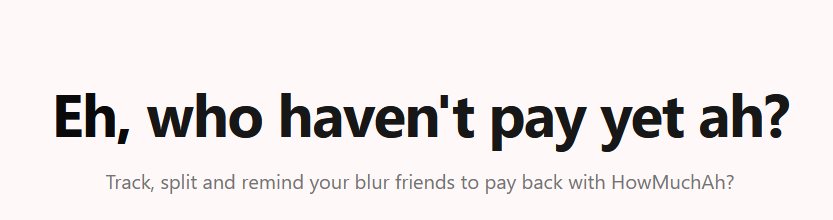
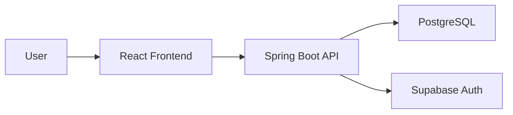

# HowMuchAh?

> A modern, mobile-first expense splitting application inspired by Splitwise, built with React and Spring Boot.

**[Live Demo](https://howmuchah.vercel.app/)** 

  

---

  
Table of Contents

  <ol>
    <li><a href="#about-the-project">About The Project</a></li>
    <li><a href="#key-features">Key Features</a></li>
    <li><a href="#tech-stack">Tech Stack</a></li>
    <li><a href="#architecture">Architecture</a></li>
    <li><a href="#getting-started">Getting Started</a></li>
    <li><a href="#project-status">Project Status</a></li>
    <li><a href="#contributing">Contributing</a></li>
  </ol>

## About The Project

HowMuchAh is a full-stack expense tracking and settlement application that helps groups manage shared expenses effortlessly. Whether it's splitting rent with roommates, tracking trip expenses with friends, or managing group dinners, HowMuchAh simplifies the process with automated settlement calculations and real-time updates.

### Why HowMuchAh?

- **Smart Settlements** - Automated debt settlement using a greedy algorithm that minimizes the number of transactions needed
- **Mobile-First** - Responsive design built for smartphones, with desktop support
- **Real-Time Updates** - WebSocket integration for instant invitation notifications
- **Flexible Splitting** - Split expenses equally or with custom amounts per person
- **Secure** - JWT authentication via Supabase with whitelist-based access control

## Key Features

### Core Functionality

- **Group Management**
  - Create and manage expense groups
  - Invite members via email
  - Shareable invitation links with usage limits and expiration
  - Real-time invitation notifications via WebSocket
  - Owner-only controls for group settings

- **Expense Tracking**
  - Add expenses with descriptions and categories
  - Support for equal splits or custom amounts
  - Multi-currency support (default: SGD)
  - Date tracking and expense history

- **Smart Settlement**
  - Automated debt calculations
  - Minimized transaction count using greedy algorithm
  - Clear visualization of who owes whom
  - Mark settlements as paid

- **User Experience**
  - Google OAuth authentication
  - Mobile-first responsive design
  - Form validation with real-time feedback
  - Toast notifications for user actions

## Tech Stack

### Frontend
<table>
  <tr>
    <td><b>Framework</b></td>
    <td>React 19 with TypeScript</td>
  </tr>
  <tr>
    <td><b>Build Tool</b></td>
    <td>Vite</td>
  </tr>
  <tr>
    <td><b>Styling</b></td>
    <td>TailwindCSS v4 + shadcn/ui (Radix UI)</td>
  </tr>
  <tr>
    <td><b>State Management</b></td>
    <td>Tanstack Query (server state), React Context (auth)</td>
  </tr>
  <tr>
    <td><b>Forms</b></td>
    <td>React Hook Form + Zod validation</td>
  </tr>
  <tr>
    <td><b>Routing</b></td>
    <td>React Router v6</td>
  </tr>
  <tr>
    <td><b>HTTP Client</b></td>
    <td>Axios</td>
  </tr>
  <tr>
    <td><b>WebSocket</b></td>
    <td>STOMP.js + SockJS</td>
  </tr>
  <tr>
    <td><b>Authentication</b></td>
    <td>Supabase Auth (Google OAuth)</td>
  </tr>
  <tr>
    <td><b>Deployment</b></td>
    <td>Vercel</td>
  </tr>
</table>

### Backend
<table>
  <tr>
    <td><b>Framework</b></td>
    <td>Spring Boot 3.5.9</td>
  </tr>
  <tr>
    <td><b>Language</b></td>
    <td>Java 25 (Amazon Corretto)</td>
  </tr>
  <tr>
    <td><b>Security</b></td>
    <td>Spring Security + OAuth2 Resource Server</td>
  </tr>
  <tr>
    <td><b>Database</b></td>
    <td>PostgreSQL (Supabase)</td>
  </tr>
  <tr>
    <td><b>ORM</b></td>
    <td>Spring Data JPA</td>
  </tr>
  <tr>
    <td><b>WebSocket</b></td>
    <td>Spring WebSocket (STOMP)</td>
  </tr>
  <tr>
    <td><b>Rate Limiting</b></td>
    <td>Bucket4j</td>
  </tr>
  <tr>
    <td><b>Build Tool</b></td>
    <td>Maven</td>
  </tr>
  <tr>
    <td><b>Deployment</b></td>
    <td>Railway (with Docker)</td>
  </tr>
</table>

## Architecture

### System Overview

## Getting Started

This repository uses Git submodules to include both frontend and backend repositories.

For detailed setup instructions, refer to the individual repositories:
- [Frontend](https://github.com/jlgsjlgs/HowMuchAh-frontend)
- [Backend](https://github.com/jlgsjlgs/HowMuchAh-backend)

## Project Status

🚧 **Closed Beta** - Currently in invitation-only testing phase (as of December 2024)

**Completed:**
- ✅ User authentication with Google OAuth
- ✅ Group creation and member management
- ✅ Expense tracking with flexible splits
- ✅ Automated settlement calculations
- ✅ Real-time WebSocket notifications
- ✅ Mobile-responsive UI
- ✅ Email invitations and shareable invitation links
- ✅ Deployed to production (Vercel + Railway)

**Planned Features:**
- [ ] Expense analytics
- [ ] Export transaction and settlement history
- [ ] User personalization features

## Contributing

Found a bug or have a feature request? Please open an [issue](https://github.com/jlgsjlgs/HowMuchAh/issues).

**Access:** Currently in closed beta. Contact the developer for access.

---